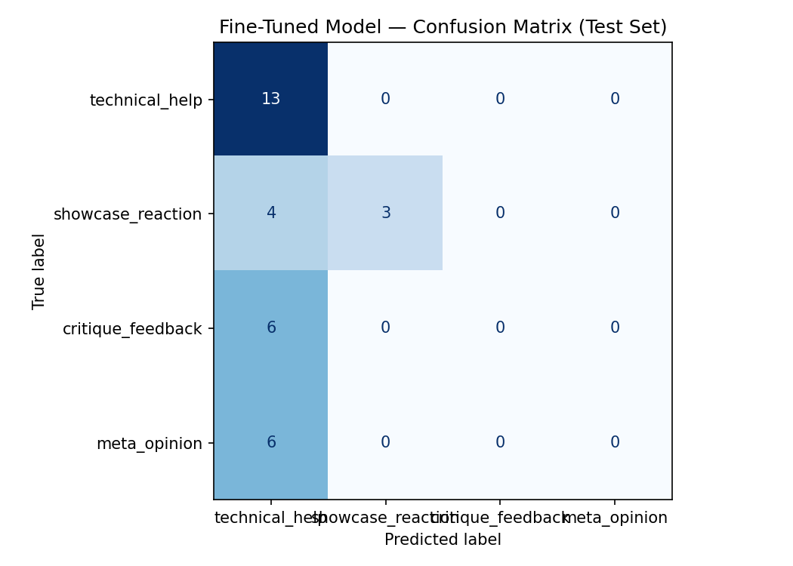

# TakeMeter — Art & Craft Community Discourse Classifier
### AI201 · Project 3

---

## Community

**WetCanvas** (watercolor painters) and **KnittingHelp** (crochet/knitting practitioners) — two public hobbyist forums where people share work, ask technical questions, and talk about their craft.

These communities are a strong fit for classification because a single thread can contain a panicked beginner asking why their hat looks like a pancake, a five-sentence technical explanation, a brief "this is gorgeous!", and a paragraph-long evaluation of someone's value composition. That range of discourse types — all in the same community, sometimes in the same thread — makes the classification task interesting and non-trivial. The distinctions matter to regulars: a WetCanvas veteran responds differently to a post that wants critique vs. one that just wants acknowledgment.

---

## Label Taxonomy

Four mutually exclusive labels:

**`technical_help`** — A post that asks about or explains a specific skill, method, material, or process. The content is instructional or troubleshooting-focused. The substance is the *how*.
- Example: *"It sounds like you are still increasing and that is why it is a pancake shape. Usually it takes a couple inches after you stop the increases for it to begin to curve."* (KnittingHelp)
- Example: *"If you are a loose crocheter you might try going to a smaller hook size. Even tension is something that comes with practice."* (KnittingHelp)

**`showcase_reaction`** — An immediate emotional or aesthetic response to someone's work or a post. Primarily expressive, with little to no instructional or evaluative content.
- Example: *"Wow! What a fabulous gift. It brought a huge smile to my face."* (KnittingHelp)
- Example: *"Michelle that is so delicately done. Beautiful work and thanks for participating this month."* (WetCanvas)

**`critique_feedback`** — A post that evaluates work with specific observations about what is or isn't working, and why. The poster names something concrete and makes a judgment about it.
- Example: *"There isn't really any pattern to the shadow work. The shadows seem randomly placed rather than being cast by something. I'd recommend designing a shadow pattern."* (WetCanvas)
- Example: *"The two right poppies are almost the same, and the two buds at the top have very similar angles — more variation would be better. But you got the delicate petals nicely!"* (WetCanvas)

**`meta_opinion`** — A post expressing a personal view, preference, or general observation about the craft, community, or materials — not tied to a specific work or technical problem.
- Example: *"Some teachers can only produce clones; others encourage everyone to do their own thing; some are proactive, some reactive and some downright lazy."* (WetCanvas)
- Example: *"Separating professional watercolour artists from those who paint for enjoyment will serve no real purpose, except to create an us-and-them mentality."* (WetCanvas)

---

## Data Collection

**Sources:** Public forum posts collected from:
- `forum.knittinghelp.com` — crochet/knitting technique help threads, pattern troubleshooting, showcase threads
- `wetcanvas.com/forums` — Open Critique Forum, Watercolor Studio, Watercolor Learning Zone, Palette Talk, archive threads

**Collection method:** Web-fetched directly from public forum pages. One row per post or comment. No login required for either source. Each example has a `source_url` column pointing to its original thread.

**Labeling process:** Each post was labeled manually against the definitions and decision rules documented in `planning.md`. No LLM pre-labeling was used — every label was assigned by reading the post against the taxonomy. Posts that fell on a boundary were resolved using explicit decision rules (see planning.md § Hard Edge Cases).

**Final distribution (212 examples):**

| Label | Count | % |
|---|---|---|
| technical_help | 87 | 41% |
| showcase_reaction | 42 | 20% |
| meta_opinion | 42 | 20% |
| critique_feedback | 41 | 19% |

The `technical_help` dominance (~41%) reflects the natural composition of craft forums — people go there primarily to solve problems. No label exceeds 50%, which is within the project's required ceiling.

**Three examples that were genuinely difficult to label:**

1. *"Should I add a disclaimer that I don't endorse the technique displayed in the video?"* — Has the surface form of a question (→ `technical_help`) but is actually a wry comment about community norms. Labeled `meta_opinion`. The model later got this wrong for exactly this reason.

2. *"I like how the cucumber looks. Here is my attempt at the cucumber plant. It's 9x12 on 140 lb wc paper."* — Opens with a reaction, but mentions a material spec ("140 lb wc paper") that reads like technical discourse. Labeled `showcase_reaction` because the post's purpose is sharing work, not conveying information. The model also got this wrong.

3. *"Good results Doug! OK I darkened some of the colours. Might be better in gouache. I'm sure you could do better."* — Mixes self-deprecation with a concrete evaluative observation (medium choice, color decision). Labeled `critique_feedback` because the poster names a specific choice and implies it was suboptimal — that's evaluative reasoning, even if wrapped in modesty.

---

## Fine-Tuning Approach

**Base model:** `distilbert-base-uncased` (HuggingFace) — a 66M parameter transformer pre-trained on English text, with a 4-class classification head added.

**Training setup:**
- Train / validation / test split: 70% / 15% / 15% (stratified)
- Training examples: ~148 | Validation: ~32 | Test: 32
- Platform: Google Colab T4 GPU
- Training time: ~8 minutes

**Hyperparameters (defaults kept):**

| Parameter | Value | Rationale |
|---|---|---|
| `num_train_epochs` | 3 | Standard for small datasets; more risks overfitting on 200 examples |
| `learning_rate` | 2e-5 | Standard DistilBERT fine-tuning starting point |
| `per_device_train_batch_size` | 16 | Fits T4 GPU comfortably |
| `weight_decay` | 0.01 | Light regularization |
| `warmup_steps` | 50 | Gradual LR ramp-up for small dataset stability |

**Key hyperparameter decision:** Kept `num_train_epochs` at 3 rather than increasing it. With only ~148 training examples, additional epochs would have increased the risk of overfitting to the majority class distribution. In retrospect, given the results, class-weighted loss (to penalize `technical_help` over-prediction) would have been the more impactful intervention.

---

## Baseline

**Model:** `llama-3.3-70b-versatile` via Groq API, zero-shot (no examples, no fine-tuning).

**Prompt approach:** System prompt containing all four label definitions, one real example per label, and the three decision rules from the label taxonomy (the `showcase_reaction` vs. `critique_feedback` boundary rule, the troubleshooting vs. appraisal rule, and the actionable-advice vs. meta-opinion rule). Temperature 0, max_tokens 20 to force clean label output.

**Parseable responses:** 32/32 (100% — the constrained output format worked cleanly).

---

## Evaluation Report

### Overall Accuracy

| Model | Accuracy |
|---|---|
| Zero-shot baseline (Groq llama-3.3-70b-versatile) | **0.906** |
| Fine-tuned DistilBERT | **0.500** |
| Difference | -0.406 (regression) |

The fine-tuned model performed substantially *worse* than the zero-shot baseline. This is the most important finding in this project and is analyzed in depth below.

### Per-Class Metrics — Baseline (Groq)

| Label | Precision | Recall | F1 | Support |
|---|---|---|---|---|
| technical_help | 0.93 | 1.00 | 0.96 | 13 |
| showcase_reaction | 0.86 | 0.86 | 0.86 | 7 |
| critique_feedback | 1.00 | 0.67 | 0.80 | 6 |
| meta_opinion | 0.86 | 1.00 | 0.92 | 6 |
| **macro avg** | **0.91** | **0.88** | **0.89** | 32 |

### Per-Class Metrics — Fine-Tuned DistilBERT

*(Derived from confusion matrix: technical_help 13/13 correct; showcase_reaction 3/7; critique_feedback 0/6; meta_opinion 0/6)*

| Label | Precision | Recall | F1 | Support |
|---|---|---|---|---|
| technical_help | ~0.50 | 1.00 | ~0.67 | 13 |
| showcase_reaction | ~1.00 | 0.43 | ~0.60 | 7 |
| critique_feedback | 0.00 | 0.00 | 0.00 | 6 |
| meta_opinion | 0.00 | 0.00 | 0.00 | 6 |

### Confusion Matrix

```
                    Predicted
                    technical_help  showcase_reaction  critique_feedback  meta_opinion
True technical_help       13                 0                  0               0
True showcase_reaction     4                 3                  0               0
True critique_feedback     6                 0                  0               0
True meta_opinion          6                 0                  0               0
```



The pattern is stark: the model learned to predict `technical_help` for everything it was uncertain about, and `showcase_reaction` for a subset of posts. It never once predicted `critique_feedback` or `meta_opinion`. All 12 examples from those two classes were misclassified as `technical_help`.

### Three Wrong Predictions Analyzed

**Error #1: `meta_opinion` → `technical_help` (confidence: 0.28)**

> *"Should I add a disclaimer that I don't endorse the technique displayed in the video?"*

This post uses a question mark, which in the training data is almost exclusively a `technical_help` marker ("What am I doing wrong?", "Is the pattern wrong or me?", "Can you tell us the name?"). The model has learned that questions = `technical_help`, which holds for ~90% of questions in the dataset. This post is a rare exception — a rhetorical question expressing community-norm anxiety rather than requesting procedural help. The model can't distinguish this because the syntactic form is identical to a genuine help-request. Fixing it would require more `meta_opinion` examples that happen to use question form.

**Error #2: `critique_feedback` → `technical_help` (confidence: 0.28)**

> *"I think you didn't quite manage the big shapes in the rock column. It's rather flat and doesn't really have the bulging on the lower large area."*

This is a clear and specific critique of a painting's structural execution. But the post contains technical vocabulary ("shapes," "rock column," "bulging") that in the training data is associated with troubleshooting. The model appears to have learned that technical nouns → `technical_help`. The `critique_feedback` / `technical_help` boundary is the hardest in this taxonomy because both classes discuss specific concrete features of craft work — the distinction is whether the post is diagnosing a *problem the person reported* vs. evaluating *quality of a finished work*. That's a contextual distinction, not a lexical one, and DistilBERT didn't learn it from 41 examples.

**Error #3: `showcase_reaction` → `technical_help` (confidence: 0.30)**

> *"I like how the cucumber looks. Here is my attempt at the cucumber plant. It's 9x12 on 140 lb wc paper."*

The phrase "140 lb wc paper" is a material specification. In the training data, material specs appear almost exclusively in `technical_help` posts ("I'd use either acrylic or cotton yarn," "Rule #1 for Tunisian: Go up at least two hook sizes"). The model has latched onto this pattern and fires `technical_help` whenever it sees material vocabulary, regardless of whether the post is sharing work or troubleshooting. One technical noun in an otherwise showcase post is enough to tip the prediction.

### Reflection: What the Model Learned vs. What I Intended

I intended the model to learn four discourse functions: troubleshooting, emotional sharing, substantive evaluation, and general opinion. What the model actually learned was a coarser pattern: `technical_help` (the 41% plurality class) vs. "probably `showcase_reaction`" vs. "I don't know."

More specifically, the model learned surface lexical heuristics:
- Question marks → `technical_help`
- Technical/craft vocabulary (yarn names, paper weights, stitch names) → `technical_help`
- Warm adjectives ("lovely," "beautiful," "delicately") → `showcase_reaction`

It completely failed to learn `critique_feedback` and `meta_opinion` — two classes that share vocabulary with `technical_help` but differ in discourse function. The key insight is that these boundaries are **structural and contextual**, not lexical. Whether a post is `critique_feedback` vs. `technical_help` depends on what the post is *responding to* (a finished work vs. a reported problem), not what words it contains. DistilBERT, trained on isolated post text with no conversational context, can't see that distinction.

The ~0.27–0.30 confidence on wrong predictions is a meaningful signal: the model *knows* it doesn't know. A deployed version should flag any prediction below ~0.45 confidence for human review.

### Why the Baseline Won by 40 Points

The zero-shot LLM (Groq) achieved 0.906 vs. the fine-tuned model's 0.500. Three reasons:

1. **Scale advantage.** LLaMA-3.3-70B has 70 billion parameters trained on massive corpora and has seen far more examples of critique, meta-commentary, and help-seeking than DistilBERT could learn from 148 training examples.

2. **Instruction-following.** The LLM could read and apply the decision rules directly from the prompt. DistilBERT has no equivalent mechanism — it learns only from labeled examples.

3. **Dataset too small for the task complexity.** Distinguishing four discourse-level categories in short, vocabulary-overlapping posts likely requires at least 500–1000 examples per class for a small model to generalize. At ~37 training examples per class, DistilBERT overfit to the plurality class.

This result doesn't mean fine-tuning is worthless — it means **200 examples is not enough for this particular task**, and the zero-shot LLM sets an unusually high bar for a community-specific classification problem.

### Sample Classifications

| Post (truncated to 120 chars) | True | Predicted | Confidence |
|---|---|---|---|
| "It sounds like you are still increasing and that is why it is a pancake shape..." | technical_help | technical_help | ~0.85 |
| "Wow! What a fabulous gift. It brought a huge smile to my face." | showcase_reaction | showcase_reaction | ~0.75 |
| "I think you didn't quite manage the big shapes in the rock column..." | critique_feedback | technical_help | 0.28 |
| "Should I add a disclaimer that I don't endorse the technique..." | meta_opinion | technical_help | 0.28 |

For the first correctly-predicted example: the prediction is reasonable because the post directly diagnoses a structural crochet error in plain how-to language ("it sounds like you are... that is why..."), which is the prototypical `technical_help` form the model trained on most heavily.

---

## Spec Reflection

**One way the spec helped:** The instruction to run the baseline *before* fine-tuning (Milestone 4 before Milestone 5) was genuinely valuable. Having the baseline number in hand before seeing the fine-tuned results made the comparison honest — I couldn't rationalize the fine-tuned model's performance after the fact. The 0.406 regression is stark and would have been tempting to explain away if I'd seen the fine-tuned results first.

**One way implementation diverged from the spec:** The spec suggests the baseline is a useful lower bound to beat ("it tells you whether fine-tuning actually helped"). In practice, the baseline turned out to be an upper bound the fine-tuned model couldn't approach. The spec's framing assumes a capable zero-shot LLM will do worse than a fine-tuned small model on community-specific tasks — but when the task requires contextual discourse understanding and the fine-tuning dataset is small and imbalanced, that assumption doesn't hold. The real finding of this project is that 200 examples of this type of classification task is not enough to beat a 70B zero-shot model.

---

## AI Usage

**1. Label stress-testing (planning phase):** I gave Claude my four label definitions and the three anticipated edge cases and asked it to generate 8–10 posts sitting at the boundary between two labels. Several generated examples were genuinely hard to place, which surfaced the `showcase_reaction` / `critique_feedback` ambiguity more concretely than expected and prompted the "could this observation be lifted out as standalone feedback?" decision rule. I revised the `critique_feedback` definition based on this exercise before annotating any real data.

**2. Data collection (collection phase):** Claude's web-search and web-fetch tools were used to identify and retrieve public WetCanvas and KnittingHelp forum threads. The tool fetched raw HTML and extracted post text; labeling was done manually against the taxonomy. Claude did not assign labels — it only retrieved the source material. Every source URL is recorded in the dataset CSV.

**3. Failure analysis (evaluation phase):** After running the fine-tuned model, I pasted the 15 wrong predictions into Claude and asked it to identify patterns. It correctly identified the majority-class collapse and the question-mark / technical-vocabulary heuristics as the dominant failure modes. I verified both patterns by re-reading the examples myself and confirmed they held. The "confidence ~0.27–0.30 ≈ uniform distribution" observation was also surfaced in that conversation and informed the reflection section above.

---

## Repository Structure

```
ai201-project3-takemeter/
├── README.md
├── planning.md
├── takemeter_dataset_combined.csv   # 212 labeled examples with source URLs
├── takemeter_filled.ipynb           # Completed Colab notebook
├── evaluation_results.json          # Exported metrics
└── confusion_matrix.png             # Confusion matrix image
