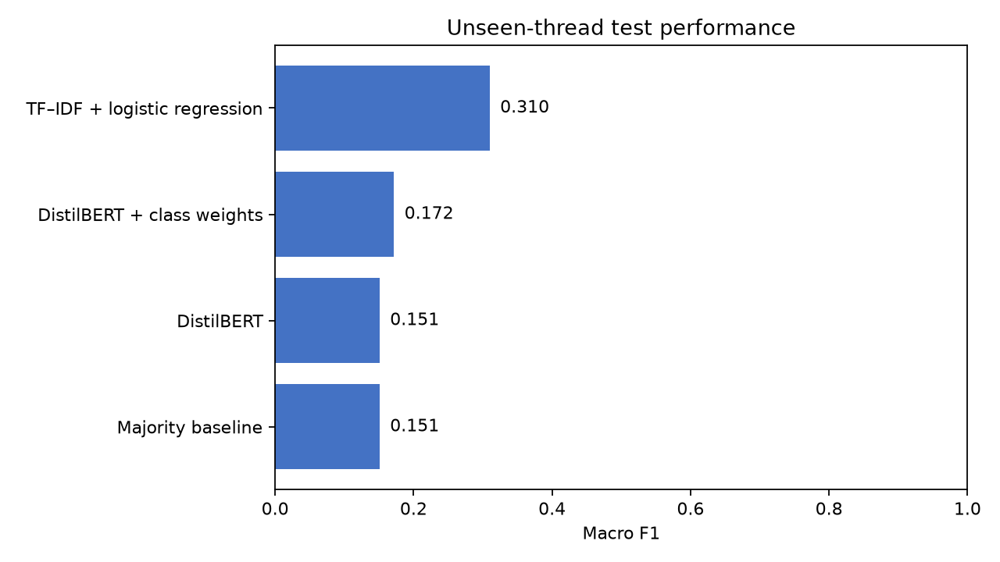

# TakeMeter

TakeMeter is a small NLP benchmark for classifying how people participate in art and craft forums. It distinguishes technical help, showcase reactions, critique, and broader opinion.

The main question is whether a model trained on a small labeled dataset can generalize to conversations it has never seen. To test that, all posts from the same forum thread stay in the same split.

## Result



TF–IDF with logistic regression produced the best macro F1 on the unseen-thread test set. DistilBERT collapsed to the most common class; weighting its loss changed its predictions but did not solve the generalization problem.

| Model | Accuracy | Macro F1 |
|---|---:|---:|
| Majority baseline | **0.432** | 0.151 |
| TF–IDF + logistic regression | 0.405 | **0.310** |
| DistilBERT | **0.432** | 0.151 |
| DistilBERT + class weights | 0.216 | 0.172 |

Macro F1 is the primary metric because the four labels are imbalanced. Accuracy alone makes the majority baseline appear stronger even though it never recognizes three of the four classes.

## Dataset

The dataset contains 212 manually labeled excerpts from 28 public WetCanvas and KnittingHelp threads. Each row includes its source URL and one of four labels:

- `technical_help`: troubleshooting or instruction about a specific method or material
- `showcase_reaction`: a primarily emotional or aesthetic response
- `critique_feedback`: a concrete evaluation of what is or is not working
- `meta_opinion`: a broader view about the craft, community, or materials

The label distribution ranges from 41 examples for `critique_feedback` to 87 for `technical_help`. See [DATA.md](DATA.md) for provenance and reuse notes.

## Evaluation design

The split is deterministic and grouped by `source_url`:

| Split | Posts | Source threads |
|---|---:|---:|
| Train | 140 | 19 |
| Validation | 35 | 5 |
| Test | 37 | 4 |

No source thread appears in more than one split. The validation set selects the logistic-regression regularization strength. Final TF–IDF and DistilBERT models train on the combined 175 development examples before the test set is evaluated once.

The benchmark compares:

1. The most common training label.
2. Word unigram and bigram TF–IDF with class-balanced logistic regression.
3. `distilbert-base-uncased`, fine-tuned for three epochs.
4. The same DistilBERT setup with inverse-frequency class weights.

The exact model revision, split counts, parameters, package versions, predictions, and per-class metrics are stored in [`results/`](results/).

## What the experiment shows

The held-out threads contain different vocabulary and conversational patterns from the development threads. With only 175 development examples, DistilBERT does not learn stable boundaries between the four discourse functions. Its unweighted version predicts `technical_help` for every test example.

TF–IDF remains weak in absolute terms, but it produces all four labels and achieves the highest macro F1. It never correctly predicts `critique_feedback`, which supports the original qualitative observation that critique and technical help often share the same craft vocabulary and differ mainly through conversational context.

These results describe this dataset and split. Four test threads are enough to expose the original leakage problem, but not enough to estimate performance across art and craft communities broadly. A stronger follow-up would collect more independent threads, retain reply context, and use grouped cross-validation.

## Run locally

Python 3.11 or newer is required.

```bash
python -m venv .venv
source .venv/bin/activate
pip install -r requirements-lock.txt
pip install --no-deps -e .
takemeter-benchmark
```

The full benchmark downloads the pinned DistilBERT checkpoint and writes fresh artifacts to `results/`. To run only the lightweight models:

```bash
pip install -r requirements-ci.txt
pip install --no-deps -e .
takemeter-benchmark --models majority tfidf
```

Run the tests with:

```bash
pytest
```

The tests validate the dataset, prevent source-thread overlap, check deterministic split assignment, and compare the lightweight benchmark against the published metrics. GitHub Actions runs the tests and a benchmark smoke test on every pull request.

## Repository layout

```text
.
├── src/takemeter/          # data validation, splits, models, and reporting
├── tests/                  # integrity and benchmark regression tests
├── results/                # metrics, predictions, run metadata, and figures
├── takemeter_dataset.csv   # labeled forum excerpts with source URLs
├── DATA.md                 # dataset provenance and reuse notes
├── pyproject.toml
└── requirements-lock.txt
```

This project began as a CodePath AI201 NLP exercise. The evaluation pipeline and published benchmark were subsequently rebuilt to test generalization across unseen source threads.
